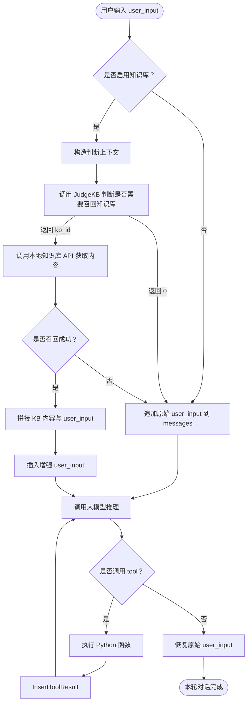

# Function-Calling 通用 Agent Demo（支持知识库联动）

这是一个基于 火山方舟 Ark SDK 构建的多轮对话系统 Demo，支持：

- ✅ 多轮对话  
- ✅ Function Call 工具调用（支持链式调用）  
- ✅ 外部知识库判断、增强召回与问题改写  
- ✅ 可插拔模块结构，便于二次集成  

---

## 📁 项目结构

```
my_project/
├── ark_fc/                      # 核心模块
│   ├── main.py                  # 程序入口
│   ├── conversation.py          # 多轮对话主逻辑
│   ├── ark_client.py            # 封装 Ark SDK 的调用逻辑
│   ├── tool_registry.py         # 注册可调用的本地函数（Tool列表）
│   ├── tool_executor.py         # 工具执行逻辑（解析调用并执行本地函数）
│   ├── judge_kb.py              # 调用大模型判断是否使用知识库
│   ├── query_kb.py              # 调用外部知识库接口获取内容
│   ├── prompts.py               # 存放系统提示词（支持多模块分离）
│   └── tools/                   # 工具函数模块
│       ├── __init__.py
│       ├── time.py              # 示例函数：获取当前时间
│       ├── weather.py           # 示例函数：查询天气
│       └── ...
```

---

## 🧠 功能概览

| 功能模块       | 描述                                           |
| -------------- | ---------------------------------------------- |
| 多轮对话       | 支持用户与 AI 助手连续对话，自动维护消息历史 |
| Function Call  | 支持模型调用本地函数（如时间、天气、直播等），并返回处理结果 |
| 知识库判断     | 使用专用模型判断是否需要查询知识库，并返回对应知识库 ID 或 “0” |
| 知识库内容拼接 | 自动发起 GET 请求查询外部 KB 内容，格式化后注入用户问题上下文中 |
| 问题改写（可选）| 可引入改写模块对用户输入进行多轮对话优化       |

---

## 🧩 核心流程说明

### 💡 核心调用链条（流程图）



---

## 🔧 使用方法

### ✅ 安装依赖

确保你已安装 `volcengine-arkruntime` SDK 及 `requests`：

```bash
pip install volcenginesdkarkruntime requests
```

### ✅ 配置密钥和模型参数

编辑 `ark_fc/config.py`：

```python
API_KEY = "your-ark-api-key"
MODEL_NAME = "doubao-1-5-pro-32k-250115"
TOOLS = [...]  # 来自 tool_registry.py 自动注册
```

---

## 🚀 运行

```bash
python ark_fc/main.py
```

交互示例：

```plaintext
欢迎使用终端聊天，输入 Q 或 q 回车可退出。
user：梳理现代密码学-数字签字和密码协议知识点内容，并从内容中提取几项学习任务。同时基于学习任务创建一个一小时后的直播，直播时长1小时，并将这个直播通知给A班级的同学

[知识库触发] 需要使用知识库 1

assistant：
### 知识点内容梳理
数字签字和密码协议是现代密码学中保障信息真实性、完整性、顺序性、时间性和不可否认性的重要内容。从参考资料可知，相关知识点包含在《现代密码学》的第7章。公钥密码体制的提出解决了单钥密码体制中密钥分配和数字签字难题，其以数学函数为基本工具、非对称形式使用两个密钥，为密码学发展带来革新[3]。

### 学习任务提取
1. 理解公钥密码体制提出的背景及解决的问题（如密钥分配和数字签字难题）。
2. 掌握公钥密码体制与传统密码算法（基于代换和置换）的区别。
3. 了解公钥密码体制以非对称形式使用两个密钥对保密性、密钥分配、认证的意义。

tool：已创建直播：现代密码学-数字签字和密码协议知识点讲解
开始时间：2025-05-08 20:19:33
结束时间：2025-05-08 21:19:33

assistant：已成功创建关于“现代密码学 - 数字签字和密码协议知识点讲解”的直播，直播时间为2025-05-08 20:19:33至2025-05-08 21:19:33。

tool：已向A班级的同学发送以下通知：
标题：现代密码学直播通知
内容：同学们，一小时后（2025-05-08 20:19:33）将开展一场关于现代密码学 - 数字签字和密码协议知识点讲解的直播，直播时长1小时，记得准时参加！

assistant：已成功将现代密码学 - 数字签字和密码协议知识点讲解的直播通知发送给A班级的同学。通知标题为“现代密码学直播通知”，内容为“同学们，一小时后（2025-05-08 20:19:33）将开展一场关于现代密码学 - 数字签字和密码协议知识点讲解的直播，直播时长1小时，记得准时参加！” 
```

---

## 🧪 示例工具模块

你可以在 `tools/` 文件夹下添加更多工具函数。例如：

### tools/time.py

```python
from datetime import datetime

def get_current_time():
    """获取当前时间字符串"""
    return datetime.now().strftime("%Y-%m-%d %H:%M:%S")
```

### tools/meeting.py

```python
def create_meeting(topic, start_time, end_time):
    """创建直播会议"""
    return f"已为你创建直播：{topic}，时间：{start_time}~{end_time}"
```

注册方式：添加至 `tool_registry.py` 即可自动生效。

---

## 🔌 模块设计原则

| 模块          | 功能                           | 是否依赖模型  |
| ------------- | ------------------------------ | ------------- |
| judge_kb      | 判断是否需要知识库，返回 kb_id 或 “0” | ✅ 模型调用    |
| query_kb      | 调用外部知识库接口，格式化返回文本 | ❌ 本地调用    |
| prompts       | 所有系统提示词集中管理，便于维护和切换 | ❌            |
| conversation  | 核心推理逻辑，支持消息管理与 tool_call | ✅ 模型调用    |

---

## 📌 注意事项

- 本地函数需返回 `str` 类型内容，作为 tool 响应；  
- 每轮 Function Call 会自动递归，直到不再调用工具；  
- 知识库内容拼接格式严格限定在 `RECALL_KB_PROMPT_START` / `RECALL_KB_PROMPT_END` 中。  

---

## 📎 TODO（建议）

- 加入改写模块（rewriter），优化多轮对话中的问题表达  
- 加入消息 ID / 轮次编号辅助 UI 或日志调试  
- 提供 Web UI / FastAPI 封装 Demo  
- 支持知识库结果缓存 + 多源召回策略  

---

## 👤 作者信息

- 作者：Ji Dengguo 
- 日期：2025 年 5 月
- QQ：327150777  
- 邮箱：jdg777111@gmail.com 327150777@qq.com
